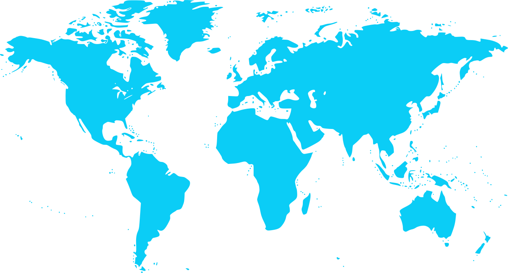

 
                      
# Strategic Asset Allocation - International

 
 

| **Strategy** &nbsp; &nbsp; &nbsp; &nbsp; &nbsp; &nbsp; &nbsp; &nbsp; &nbsp; &nbsp; &nbsp; &nbsp; &nbsp; &nbsp; &nbsp; &nbsp; &nbsp; &nbsp; &nbsp; &nbsp;                           |**Allocation**|
|:------------------------------------------------------|:------------:|
| <a href="#aa"> Adaptive Asset Allocation </a>         |     ≈100%    |

 

* 20% - Based on [Breadth Momentum and the Canary Universe: Defensive Asset Allocation (DAA)](https://papers.ssrn.com/sol3/papers.cfm?abstract_id=3212862)
* 20% - Based on [A Century of Generalized Momentum; From Flexible Asset Allocations (FAA) to Elastic Asset Allocation (EAA)](https://papers.ssrn.com/sol3/papers.cfm?abstract_id=2543979)
* 20% - Based on [Keuning & Keller’s Generalized Protective Momentum](https://allocatesmartly.com/keuning-kellers-generalized-protective-momentum/)
* 20% - Based on [Breadth Momentum and Vigilant Asset Allocation (VAA): Winning More by Losing Less](https://papers.ssrn.com/sol3/papers.cfm?abstract_id=3002624)
* 20% - Based on [Aspect Partners’ Risk Managed Momentum](https://allocatesmartly.com/aspect-partners-risk-managed-momentum/)

- Allocation 
    - Based on average of three overlapping portfolios rebalanced monthly on 01st, 11th and 21st repectively.
    
---    

 
 

